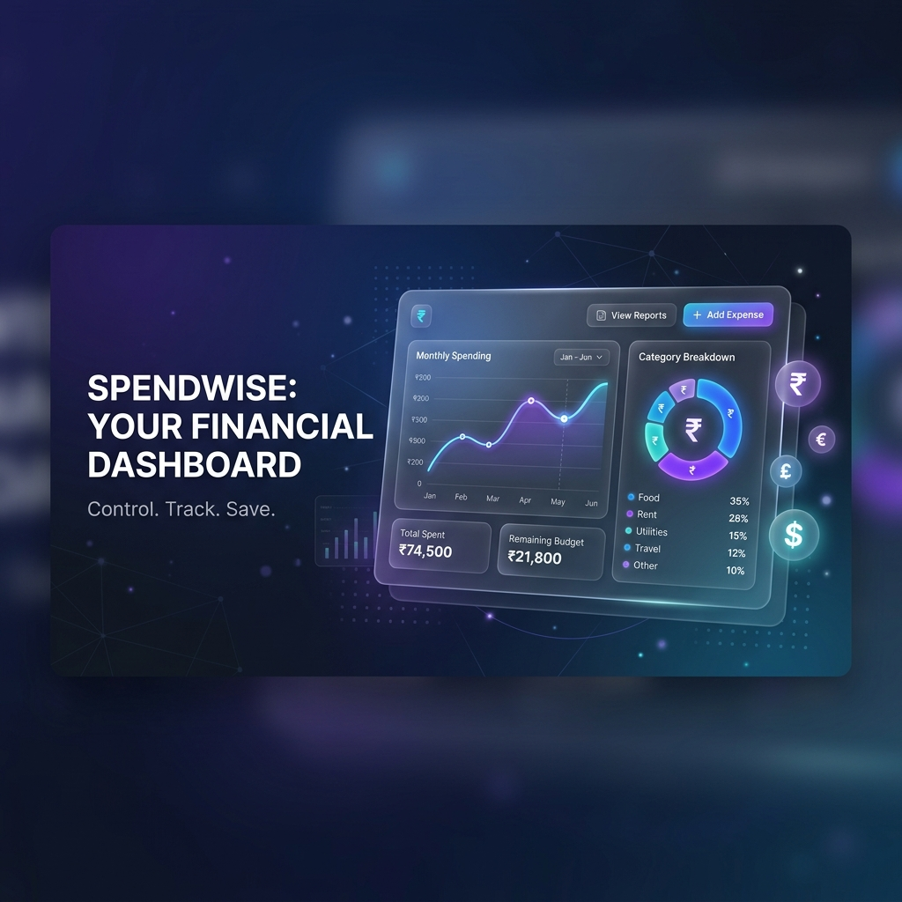
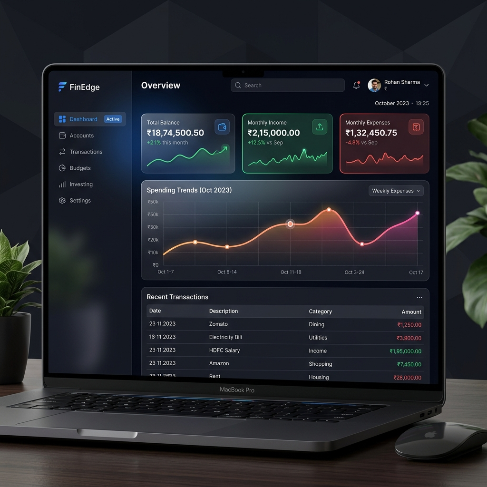

# 💎 ExpenseTracker - Premium Finance Management



[](#)
[](#)
[](#)
[](#)

A professional-grade, full-stack personal finance application designed for speed, clarity, and aesthetics. Built with a modern **Glassmorphism** design language, this tracker offers a seamless experience ranging from real-time analytics to fluid page transitions.

---

## ✨ Visual Experience



> [!TIP]
> Our UI is optimized for high-contrast visibility and reduced eye strain using a deep-dark priority system.

---

## 🚀 Elite Features

- **🎬 Fluid Page Transitions**: Experience app-like smoothness with the modern **View Transitions API**.
- **⚡ Optimized PWA**: Service Worker optimized for navigation stability, ensuring zero downtime during page transitions.
- **🌙 Dual-Theme Engine**: Premium, deep-dark mode priority with a smooth toggle to light mode. Preferences are persisted locally.
- **📈 Professional Analytics**: Interactive Bar and Doughnut charts (powered by Chart.js) providing deep insights into monthly spending.
- **📥 CSV Data Export**: Instantly download your full transaction history into a spreadsheet-compatible format.
- **🔍 Advanced Search & Filtering**: Real-time server-side searching combined with intuitive date-range and category filters.
- **📱 PWA Ready**: Fully installable on Android, iOS, and Desktop. Includes a Service Worker for offline loading.
- **🛡️ Secure JWT Auth**: Industry-standard JSON Web Token authentication with persistent sessions.
- **✨ Premium UI Feedback**: Custom Toast notification system and elegant confirmation modals for a high-end feel.
- **🇮🇳 Rupee Native**: Specialized for the Indian market with native ₹ currency formatting.

---

## 🛠️ Technology Stack

| Layer | Technology |
| :--- | :--- |
| **Frontend** | Vanilla HTML5, CSS3 (Glassmorphism), JavaScript (ES6+) |
| **Charts** | Chart.js |
| **Backend** | Node.js, Express.js |
| **Database** | MongoDB via Mongoose ODM |
| **Security** | JWT (JSON Web Tokens), bcryptjs |

---

## ⚙️ Installation & Setup

### 1. Prerequisites
- [Node.js](https://nodejs.org/) (v16+)
- [MongoDB](https://www.mongodb.com/try/download/community) (Local or Atlas)

### 2. Backend Setup
1. Navigate to the `backend` folder.
2. Rename `.env.example` to `.env`.
3. Update `MONGO_URI` with your MongoDB connection string.
4. Install dependencies:
```bash
npm install
npm start
```
*Server runs on `http://localhost:5000`*

### 3. Frontend Setup
The frontend is built with vanilla technologies. Simply serve the `frontend` directory:
```bash
npx serve -l 3000 frontend
```
*Access via `http://localhost:3000`*

> [!IMPORTANT]
> **Production Tip**: When deploying to a live server, update the `BASE_URL` constant in all `frontend/js/*.js` files to point to your production API URL.

---

## 📊 API Documentation Overview

| Endpoint | Method | Description |
| :--- | :--- | :--- |
| `/api/auth/register` | `POST` | Create a new account |
| `/api/auth/login` | `POST` | Authenticate and get JWT |
| `/api/expenses` | `GET` | Fetch transactions with search/filter |
| `/api/expenses` | `POST` | Log a new income/expense |
| `/api/analytics/summary` | `GET` | Get total income, expense, and balance |
| `/api/budgets` | `POST` | Set or update category budget limits |

---

## 🎨 Design Philosophy
The application utilizes a **Glassmorphism** design system, focusing on:
- **Depth**: Subdued backgrounds with translucent surface blurs.
- **Focus**: High-contrast typography using the Inter font family.
- **Feedback**: Smooth micro-animations and transitions for every user interaction.
- **Responsiveness**: Fluid layouts that adapt from mobile to desktop.

---

## 📝 License
This project is licensed under the MIT License.

